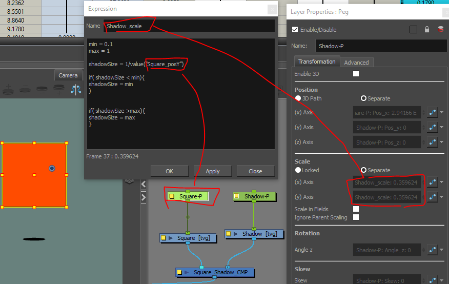
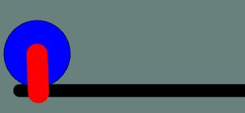
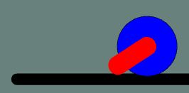
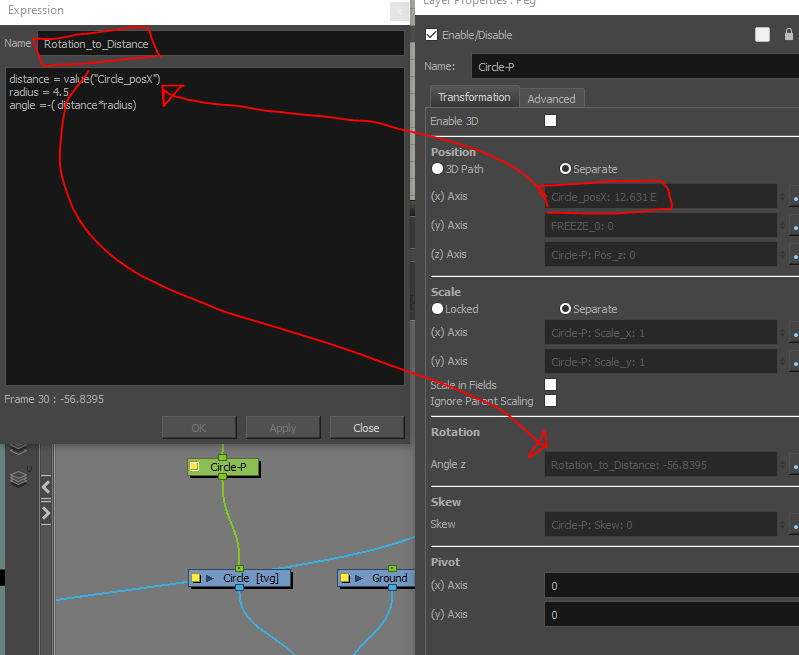
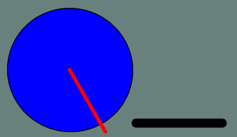
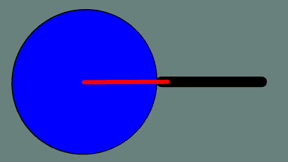
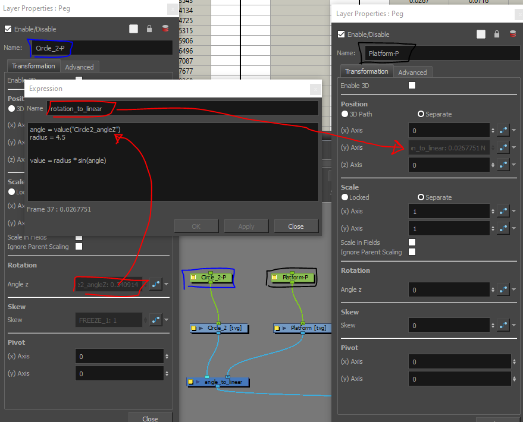

# Expressions in Harmony

Screenshots of the examples we did in Day 10's session

# shadow that scales as its parent moves higher
* move the red square up and the shadow reduces in size (down to a minimum), lower the square and it increases (up to a maximum) 


``` javascript
min = 0.1
max = 1

shadowSize = 1/value("Square_posY")

if( shadowSize < min){
shadowSize = min
}


if( shadowSize >max){
shadowSize = max
}

```

# circle that rotates appropriate to distance traveled
* move circle left/ right and the rotation is correct according to the ground plane
  
 --> 
```javascript
distance    = value("Circle_posX")
radius      = 4.5
angle       = -( distance*radius)
```


# linear position of point on a circumfrence
* rotate the circle and the plaform will move up or down to match the correct y value of the red line on the circumfrence
  
 --> 
```javascript
angle       = value("Circle2_angleZ")
radius      = 4.5
value       = radius * sin(angle)
```

